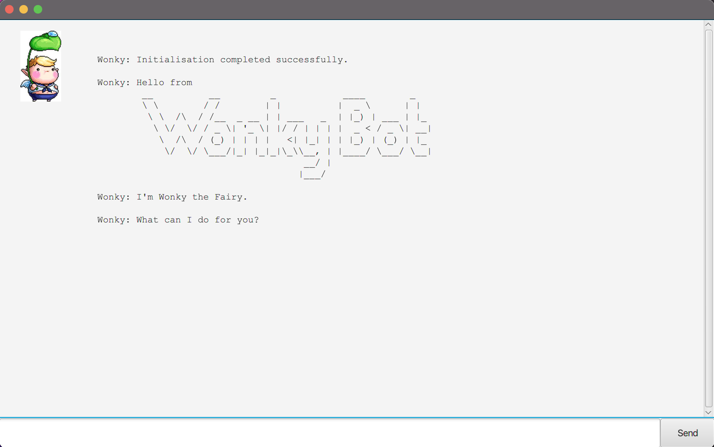

#   Welcome to Wonky Bot

Wonky Bot is a friendly and helpful chatbot designed to assist you with your daily tasks. It can help you manage your to-do list, set deadlines, plan events, and much more. With a simple and intuitive interface, Wonky Bot makes it easy to stay organised and productive.

Whether you're keeping track of work assignments, managing personal projects, or just need a little help staying on top of your schedule, Wonky Bot is here to help. Just type in a command, and Wonky Bot will handle the rest.

Get started with Wonky Bot today and make your day a little less wonky!

## Setting up in Intellij

Prerequisites: JDK 11, update Intellij to the most recent version.

1. Open Intellij (if you are not in the welcome screen, click `File` > `Close Project` to close the existing project first)
1. Open the project into Intellij as follows:
   1. Click `Open`.
   1. Select the project directory, and click `OK`.
   1. If there are any further prompts, accept the defaults.
1. Configure the project to use **JDK 11** (not other versions) as explained in [here](https://www.jetbrains.com/help/idea/sdk.html#set-up-jdk). 
   In the same dialog, set the **Project language level** field to the `SDK default` option.
3. After that, locate the `src/main/java/seedu/duke/gui/Launcher.java` file, right-click it, and choose `Run Launcher.main()` (if the code editor is showing compile errors, try restarting the IDE). If the setup is correct, you should see something like the below as the output:

