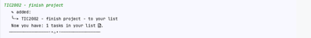
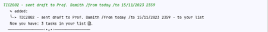
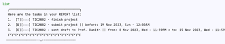
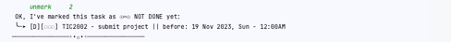

# CrabY 🦀 Project Report

## User Stories

1. As a user, I want to be able to add a task to the task list.

    - The task list should be able to store different types of tasks.
    - The task list should be able to store tasks with the autoformatting of date and time.

2. As a user, I want to be able to delete a task from the task list.

    - The task list should be able to delete a task by its index in the task list.
    - The task list should be able to delete all tasks at one time if the user wants to clear the task list.

3. As a user, I want to be able to mark a task as done or unmark a task as undone.

    - The task list should be able to mark a task as done by its index in the task list.
    - The task list should be able to unmark a task as undone by its index in the task list.
    - The task list should be able to mark all tasks as done at one time if the user wants to mark all tasks as done.
    - The task list should be able to unmark all tasks as undone at one time if the user wants to unmark all tasks as
      undone.

4. As a user, I want to be able to find a task by its description.

    - The task list should be able to find a task by its description or type or date or time of the task.

5. As a user, I want to be able to sort the task list by its description or type or date

    - The task list should be able to sort the task list by its description or type or date or time of the task.

6. As a user, I want to be able to reuse the task list after I exit the program and get back to the program.

    - The task list should be able to save the task list to a local file.
    - The task list should be able to load the task list from a local file.
    - Delete the local file when it empties the task list.
    - Create a new local file when it creates a new task list.

7. As a user, I want to be able to see the list of commands that I can use when I forget how to use the program.

8. As a user, I want to be able to see all the tasks in the task list that I have added.

9. As a user, I want to be able to undo the previous command.

    - The task list should be able to undo all the previous commands from I start the program.

10. As a user, I want to be able to switch between different task lists, so I just need to type, no need to close the
    program and open it again.

11. As a user, I want to be able to see all checklists that I have created, so I can choose which checklist I want to
    switch to.

## Non-Functional Requirements

1. The program should be able to run on any platform.
2. The program should be able to run on any device.
3. The program should be able to run on any screen size.
4. The program should be able to run on Mac, Windows, and Linux.

## Showcase

1. Show the output Duke shows when you launch the program.

     

     

2. Todo, Deadlines, Events Give examples of command(s) and expected outputs for adding different types of tasks.

   * Todo

   

   * Deadline

   

   * Event

   

3. The List Gives examples of command(s) and expected outputs for listing tasks.

     

4. Mark, Unmark Give examples of command(s) and expected outputs for marking/unmarking tasks as done.

    * Mark
   
    

    

    * Unmark

    

    

5. Errors Describe what kind of errors Duke can handle. E.g., give different types of incorrect commands (and the
   expected outputs) it can handle
    - If the user types in an invalid index, CrabY will show the error message and ask the user to type in a valid
      index.
   ```
   mark TIC2002
      Oops!!! Looks like you used the wrong format (╯︵╰,)
      ╰┈➤ Try with: mark [integer] e.g: mark 1
                or: mark all - to mark all the tasks in your list.
      ┈┈┈┈┈┈┈┈┈┈┈┈┈┈┈┈◦•✩•◦┈┈┈┈┈┈┈┈┈┈┈┈┈┈┈┈
   ```
   ``` 
   mark 100
      Oops!!! Something wrong! Your list only have 1 ➞ 3 tasks (╯︵╰,)
      ╰┈➤ Please try again with another number ☘
      ┈┈┈┈┈┈┈┈┈┈┈┈┈┈┈┈◦•✩•◦┈┈┈┈┈┈┈┈┈┈┈┈┈┈┈┈
   ```
   **Note that:** CrabY can handle cases insensitive and multiple space in the input.

    - If the user types in an invalid date or time, CrabY will show the error message and ask the user to type in a
      valid
      date or time.
    ```
   test error date time /by 15 Nov 16:30
      Oops!!! Looks like you used the wrong format (╯︵╰,)
      Please enter in this format after used /by or /from and /to
      ╰┈➤ Try with: "/by dd/mm/yyyy hhmm" e.g: /by 12/12/2020 1800
                or: "/by mon" - CrabY will put the date to the next Monday
      ┈┈┈┈┈┈┈┈┈┈┈┈┈┈┈┈◦•✩•◦┈┈┈┈┈┈┈┈┈┈┈┈┈┈┈┈
    ```
    - If the user puts the blank space in the description or just enter, CrabY will show the error message and ask the
      user to type in a
      valid description.
    ```
                       
      Oops!!! The description cannot be empty.
      ╰┈➤Type "help" if you need to see the list of command
      ┈┈┈┈┈┈┈┈┈┈┈┈┈┈┈┈◦•✩•◦┈┈┈┈┈┈┈┈┈┈┈┈┈┈┈┈
    ```
   ```
   /from tomorow
      Oops!!! The description cannot be empty.
      ╰┈➤Type "help" if you need to see the list of command
      ┈┈┈┈┈┈┈┈┈┈┈┈┈┈┈┈◦•✩•◦┈┈┈┈┈┈┈┈┈┈┈┈┈┈┈┈
   ```

    - If the user types in an invalid command, CrabY will still add to the task list.
    - Craby can handel 4 types of the date format, user can put the time or not, if the user doesn't put the time, CrabY
      will put the time to 12:00AM.
        - dd/mm/yyyy hhmm
        - yyyy/mm/dd hhmm
        - dd-mm-yyyy hhmm
        - yyyy-mm-dd hhmm
6. Delete Give examples of command(s) and expected outputs for deleting tasks.
   ```
   delete 1
      ✂ Noted. I've removed this task:
      ╰┈➤ [T][҉҉҉] TIC2002 - finish project - in your list
      Now you have: 2 tasks in your list 🗎.
      ┈┈┈┈┈┈┈┈┈┈┈┈┈┈┈┈◦•✩•◦┈┈┈┈┈┈┈┈┈┈┈┈┈┈┈┈

   ```

   ```
   delete all
      ✂ Ok, I have clear up all your tasks.
      ╰┈➤ Let's start a new checklist 
      ┈┈┈┈┈┈┈┈┈┈┈┈┈┈┈┈◦•✩•◦┈┈┈┈┈┈┈┈┈┈┈┈┈┈┈┈
   ```

7. Save Give a sample of the tasks as they are stored in the hard disk.
   ```
   T || 0 || TIC2002 - finish project
   D || 0 || TIC2002 - submit project || 19/11/2023 0000
   E || 0 || TIC2002 - sent draft to Prof. Damith || 08/11/2023 0000 || 15/11/2023 2359
   ```

8. Dates Give examples (i.e., screenshots of commands and outputs) of how your Duke uses dates/times in meaningful ways
   i.e., what commands can use dates/times in meaningful ways? E.g., is it possible to list deadlines/events on a
   specific
   day? Does it detect invalid dates given by the user?
    - Easy to format 4 types of date format (dd/mm/yyyy hhmm, yyyy/mm/dd hhmm, dd-mm-yyyy hhmm, yyyy-mm-dd hhmm) to what
      I want to show to the user.
    - If the event is on the same day, CrabY will show the date only once.
    ```
   group meeting /from 2023/11/14 1830 /to 14-11-2023 2000
      ✎ added:
      ╰┈➤ group meeting /from 14/11/2023 1830 /to 14/11/2023 2000 - to your list
      Now you have: 4 tasks in your list 🗎.
   ```
      -->
   ```
      4.  [E][҉҉҉] Group meeting || from: 14 Nov 2023, Tue - 06:30PM ➞ to: 08:00PM
   ```

9. Find Give examples of command(s) and expected outputs for searching for tasks.
   ```
   list
      ╭─────────────────────────────────────╮
      Here are the tasks in your REPORT list:
      1.  [T][҉҉҉] TIC2002 - finish project
      2.  [D][҉҉҉] TIC2002 - submit project || before: 19 Nov 2023, Sun - 12:00AM
      3.  [E][҉҉҉] TIC2002 - sent draft to Prof || from: 8 Nov 2023, Wed - 11:59PM ➞ to: 15 Nov 2023, Wed - 12:00AM
      4.  [E][҉҉҉] Group meeting || from: 14 Nov 2023, Tue - 06:30PM ➞ to: 08:00PM
      ꒦꒷꒦꒷꒦꒷꒦꒷꒦꒷꒦꒷꒦꒷꒦꒷꒦꒷꒦꒷꒦꒷꒦꒷꒦꒷꒦꒷꒦꒷꒦꒷꒦꒷꒦꒷꒦꒷꒦꒷꒦
      ┈┈┈┈┈┈┈┈┈┈┈┈┈┈┈┈◦•✩•◦┈┈┈┈┈┈┈┈┈┈┈┈┈┈┈┈
   find project
      ⌖ Here are the list tasks matching with "project":
      [T][҉҉҉] TIC2002 - finish project
      [D][҉҉҉] TIC2002 - submit project || before: 19 Nov 2023, Sun - 12:00AM
      ┈┈┈┈┈┈┈┈┈┈┈┈┈┈┈┈◦•✩•◦┈┈┈┈┈┈┈┈┈┈┈┈┈┈┈┈
   find tue
      ⌖ Here are the list tasks matching with "tue":
      [E][҉҉҉] Group meeting || from: 14 Nov 2023, Tue - 06:30PM ➞ to: 08:00PM
      ┈┈┈┈┈┈┈┈┈┈┈┈┈┈┈┈◦•✩•◦┈┈┈┈┈┈┈┈┈┈┈┈┈┈┈┈
   find book
      ✘ No tasks matching with "book" in your list.
      ╰┈➤ Please try with another keyword ☘
      ┈┈┈┈┈┈┈┈┈┈┈┈┈┈┈┈◦•✩•◦┈┈┈┈┈┈┈┈┈┈┈┈┈┈┈┈
   ```
   
10. GUI/individual feature If you implement a GUI, give some screenshots. If you implement an individual feature, describe that feature.
    - C-Undo
        + You can undo the previous command by typing `undo` and then enter.
        + You can undo the add, delete, mark, unmark, and sort command.
        + You can undo all tasks to the task they start the program.

    - C-Sort
        + You can sort the task list by its type or date and time of the task.
        + If you want to sort the task list by its type, you can type `sort type` or `sort t` and then enter.
        + If you want to sort the task list by its type reverse, you can type `sort type-r` or `sort tr` and then enter.
        + If you want to sort the task list by its date and time, you can type `sort date` or `sort d` and then enter.

    - C-Help
        + You can see the list of commands that you can use by typing `help` and then enter.

    - C-NaturalDates (matching last student number: 3)
        + Support more natural date formats e.g., Mon in a user command can be interpreted as the date of the next Monday in the calendar.

11. Other features Describe other features you implement (i.e., not described above), if any e.g., optional increments.

    - When the system starts, the user can choose the checklist that they want to work on.
    - Reason for doing this feature: When I put a lot of tasks in the list, I want to separate them into different
      categories, so I can work on them one by one, and it will be easier to manage.
    - How to use this feature:
        + You can choose the checklist that they want to work on by typing the name of the checklist at the beginning
          of the program.
        + If you want to create a new checklist, they can type the name of the checklist that they want to create.
        + If you type in the name of an existing checklist, they can continue working on the checklist that already has the tasks they set before.
        + If you want to switch to another checklist, they can type `switch` and then enter. After that, the user
          can type the checklist name that they want to work on.
        + If you want to see all the checklists that they have created, they can type `checklists` and then enter.
          After that, you can see all the checklists that they have created.

    - Screenshots: 
