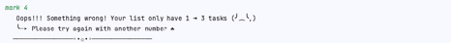
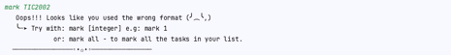

# CrabY 🦀 Project Report

## User Stories

1. As a user, I want to be able to add a task to the task list.

    - The task list should be able to store different types of tasks.
    - The task list should be able to store tasks with the autoformatting of date and time.

2. As a user, I want to be able to delete a task from the task list.

    - The task list should be able to delete a task by its index in the task list.
    - The task list should be able to delete all tasks at one time if the user wants to clear the task list.

3. As a user, I want to be able to mark a task as done or unmark a task as undone.

    - The task list should be able to mark a task as done by its index in the task list.
    - The task list should be able to unmark a task as undone by its index in the task list.
    - The task list should be able to mark all tasks as done at one time if the user wants to mark all tasks as done.
    - The task list should be able to unmark all tasks as undone at one time if the user wants to unmark all tasks as
      undone.

4. As a user, I want to be able to find a task by its description.

    - The task list should be able to find a task by its description or type or date or time of the task.

5. As a user, I want to be able to sort the task list by its description or type or date

    - The task list should be able to sort the task list by its description or type or date or time of the task.

6. As a user, I want to be able to reuse the task list after I exit the program and get back to the program.

    - The task list should be able to save the task list to a local file.
    - The task list should be able to load the task list from a local file.
    - Delete the local file when it empties the task list.
    - Create a new local file when it creates a new task list.

7. As a user, I want to be able to see the list of commands that I can use when I forget how to use the program.

8. As a user, I want to be able to see all the tasks in the task list that I have added.

9. As a user, I want to be able to undo the previous command.

    - The task list should be able to undo all the previous commands from I start the program.

10. As a user, I want to be able to switch between different task lists, so I just need to type, no need to close the
    program and open it again.

11. As a user, I want to be able to see all checklists that I have created, so I can choose which checklist I want to
    switch to.

## Non-Functional Requirements

1. The program should be able to run on any platform.
2. The program should be able to run on any device.
3. The program should be able to run on any screen size.
4. The program should be able to run on Mac, Windows, and Linux.

## Showcase

1. Show the output Duke shows when you launch the program.

   

   

2. Todo, Deadlines, Events Give examples of command(s) and expected outputs for adding different types of tasks.

    * Todo

   

    * Deadline

   

    * Event

   

3. The List Gives examples of command(s) and expected outputs for listing tasks.

   

4. Mark, Unmark Give examples of command(s) and expected outputs for marking/unmarking tasks as done.

    * Mark

   

   

    * Unmark

   

   

5. Errors Describe what kind of errors Duke can handle. E.g., give different types of incorrect commands (and the
   expected outputs) it can handle
    - If the user types in an invalid index, CrabY will show the error message and ask the user to type in a valid
      index.

   

   

   **Note that:** CrabY can handle cases insensitive and multiple space in the input.

    - If the user types in an invalid date or time, CrabY will show the error message and ask the user to type in a
      valid date or time.

   

    - If the user puts the blank space in the description or just enter, CrabY will show the error message and ask the
      user to type in a valid description.

   

    - If the user types in an invalid command, CrabY will still add to the task list.
    - Craby can handel 4 types of the date format, user can put the time or not, if the user doesn't put the time, CrabY
      will put the time to 12:00AM.
        - dd/mm/yyyy hhmm
        - yyyy/mm/dd hhmm
        - dd-mm-yyyy hhmm
        - yyyy-mm-dd hhmm
6. Delete Give examples of command(s) and expected outputs for deleting tasks.

   

7. Save Give a sample of the tasks as they are stored in the hard disk.

   

   ** Note that I had covered in case someone wanted to break my data with || which I used to detect when loading data
   files

   

   example:

   

   

8. Dates Give examples (i.e., screenshots of commands and outputs) of how your Duke uses dates/times in meaningful ways
   i.e., what commands can use dates/times in meaningful ways? E.g., is it possible to list deadlines/events on a
   specific
   day? Does it detect invalid dates given by the user?
    - You can add the date and time by using the format `dd/mm/yyyy hhmm` or `yyyy/mm/dd hhmm` or `dd-mm-yyyy hhmm` or
      `yyyy-mm-dd hhmm`.
    - More than that, you can use the natural date format
      e.g.
      `mon` or `monday` will be interpreted as the date of the next Monday in the calendar.
      ...
      `sun` or `sunday` will be interpreted as the date of the next Sunday in the calendar.
      `today` will be interpreted as the date of today in the calendar.
      `tmr` or `tomorrow` will be interpreted as the date of tomorrow in the calendar.
      `eom` or `end of month` will be interpreted as the date of the end of this month in the calendar.
      `eoy` or `end of year` will be interpreted as the date of the end of this year in the calendar.
    - If you don't put the time, the system will put the time to 12:00AM.
    - If the year is the same as the current year, the system will not display the year to make it easier to read.

    

    - In the event task, if /to same day as /from, the system will only display the date once.

    

9. Find Give examples of command(s) and expected outputs for searching for tasks.

   

10. GUI/individual feature If you implement a GUI, give some screenshots. If you implement an individual feature,
    describe that feature.
    - C-Undo
        + You can undo the previous command by typing `undo` and then enter.
        + You can undo the add, delete, mark, unmark, and sort command.
        + You can undo all tasks to the task they start the program.

    - C-Sort
        + You can sort the task list by its type or date and time of the task.
        + If you want to sort the task list by its type, you can type `sort type` or `sort t` and then enter.
        + If you want to sort the task list by its type reverse, you can type `sort type-r` or `sort tr` and then enter.
        + If you want to sort the task list by its date and time, you can type `sort date` or `sort d` and then enter.

    - C-Help
        + You can see the list of commands that you can use by typing `help` and then enter.

    - C-NaturalDates (matching last student number: 3)
        + Support more natural date formats e.g., Mon in a user command can be interpreted as the date of the next
          Monday in the calendar.

11. Other features Describe other features you implement (i.e., not described above), if any e.g., optional increments.

    - When the system starts, the user can choose the checklist that they want to work on.
    - Reason for doing this feature: When I put a lot of tasks in the list, I want to separate them into different
      categories, so I can work on them one by one, and it will be easier to manage.
    - How to use this feature:
        + You can choose the checklist that they want to work on by typing the name of the checklist at the beginning
          of the program.
        + If you want to create a new checklist, they can type the name of the checklist that they want to create.
        + If you type in the name of an existing checklist, they can continue working on the checklist that already has
          the tasks they set before.
        + If you want to switch to another checklist, they can type `switch` and then enter. After that, the user
          can type the checklist name that they want to work on.
        + If you want to see all the checklists that they have created, they can type `checklists` and then enter.
          After that, you can see all the checklists that they have created.

     
12. MoreOOP Give a class diagram to match your code. Do not use auto-generated diagrams. Omit less important classes, attributes, methods. Follow the given UML notation exactly.
    
    - Class Diagram
    
    Give at least one object diagram illustrating the state of your program at some point. It should include at least one object of each of the important classes in your project.
    
    - Object Diagram
    
    Give at least one sequence diagram illustrating an object interaction in your product.
    
    - Sequence Diagram

13. A-JavaDoc: Give at least 2 javadoc comments from you code.

    

    

14. A-JUnit: Give 2-3 JUnit test methods from your code.

    

    

15. A-Assertions: Give at least 2 code segments that contain assertions you added to your code.

    

    

16. Suggested test commands Give a list of commands a tester can execute in sequence to examine your product. Cover all features in a reasonable order.